# Unknown_Possibilities


Unknown Possibilities is a full-stack e-commerce website built using Django, Python, JavaScript, and Bootstrap 5.
It was created as my fourth and final milestone project for Code Institute's Full Stack Web Development course.

The site offers mystical and spiritual products such as Tarot cards, crystal sets, Runes, and Oracle readings.
It also features an interactive "Daily Card Draw" and allows users to book readings, manage their profile, and shop securely online.

I have dyslexia and have gone through the code and content many times. I really hope the spelling is correct.


# CONTENTS

* [User Experience](#user-experience)
    * [Strategy Plane](#strategy-plane)
        * [Project Goals](#project-goals)
    * [Scope Plane](#scope-plane)
    * [Structure plane](#structure-plane)
        * [User Stories](#user-stories)
        * [Database Schema](#database-schema)
    * [Skeleton Plane](#skeleton-plane)
        * [Wireframes](#wireframes)
    * [Surface Plane](#surface-plane)
        * [Colour Scheme](#colour-scheme)
        * [Typography](#typography)
        * [Images](#images)
        * [Base Mockup](#base-mockup)
    * [Features](#features)
        * [General Features of the site](#general-features-of-of-the-site)
        * [Sites header and footer images](#sites-header-and-footer-images)
        * [Defensive Programming](#defensive-programming)
        * [Features for the next level](#features-for-next-version)
        * [Home Page](#home-page)
        * [Products Page](#products-page)
        * [Product Details Page](#product-detail-page)
        * [Readings With booking Page](#readings-with-booking-page)
        * [Daily Card Draw Page](#daily-card-draw-page)
        * [Bag Page](#bag-page)
        * [Admin Page for managing the site](#admin-page-for-managing-the-site)
        * [Signup Page](#signup-page)
        * [Log in page](#log-in-page)
        * [Log out page](#log-in-page)
    * [Future Implementations](#future-implementations)
    * [Accessibility](#accessibility)
    * [Technologies Used](#technologies-used)
    * [Languages Used](#languages-used)
    * [Databas Used](#database-used)
    * [Frameworks Used](#frameworks-used)
    * [Libraries & Packages Used](#libraries--packages-used)
    * [Program Used](#program-used)
    * [Deployment & Local Development](#deployment--local-development)
        * [Heroku app setup](#heroku-app-setup)
        * [Preparation for deployment in VSCode](#preparation-for-deployment-in-vscode)
    * [Testing](#testing)
    * [Credits](#credits)
        * [Code used](#code-used)
        * [Content](#content)
        * [Media](#media)
        * [Acknowledgments](#acknowledgments)
    * [Final Thoughts](#final-thoughts)

##  User Experience

###  Strategy Plane

####  Project Goals

**Site Owner Goals:**
- Create a unique online store that sells mystical items such as Tarot cards, crystals, and Rune sets.
- Offer interactive spiritual features such as a daily Tarot draw and booking options for personal readings.
- Provide a user-friendly and visually captivating shopping experience.
- Allow users to register, log in, and view their order history.
- Build a secure and responsive full-stack website using Django.

**User Goals:**
- Discover and purchase mystical products easily.
- Learn more about different spiritual tools such as Tarot and Runes.
- Book personal readings with various time slots.
- Get inspired through daily card draws.
- Manage personal profiles, view order history, and edit saved info.
- Feel immersed in a mystical, calm, and intuitive design.

---

###  Scope Plane

The site includes:
- A product catalogue for Tarot cards, crystals, runes, and readings.
- A shopping bag and Stripe-powered checkout.
- User account features with order history and saved details.
- An admin panel for managing products.
- Special features like:
  - Daily card draw (login required, once per day).
  - Bookable readings with available times and durations.

---
###  Structure Plane

####  User Stories

| User Story ID | As a/an         | I want to be able to ...                   | So that I can ...                           |
| ------------- | --------------- | ------------------------------------------ | ------------------------------------------- |
| 1             | Visitor         | view all products                          | explore what the site offers                |
| 2             | User            | view detailed information about products   | learn more before deciding to buy           |
| 3             | Visitor         | browse the site easily                     | find interesting products or categories     |
| 4             | Shopper         | view my basket                             | check my selected items before checkout     |
| 5             | Visitor         | register an account                        | create a profile and access user features   |
| 6             | Registered user | log in or log out                          | securely access or leave my account         |
| 7             | User            | reset my password                          | regain access if I forget it                |
| 8             | New user        | confirm my email address                   | verify my account for security              |
| 9             | Logged in user  | view my profile                            | see my details and order history            |
| 10            | User            | sort products                              | quickly find what suits me                  |
| 11            | User            | view a specific category                   | browse products of that type                |
| 12            | Admin           | organize products into multiple categories | structure the store clearly                 |
| 13            | User            | search for products by name or description | easily find specific items                  |
| 14            | User            | view search results                        | get relevant product matches                |
| 15            | Visitor         | browse and interact with the site          | get an overview before deciding to register |

[User stories image](documentation/readme/user-stories.png)
---

###  Database Schema

This project uses a relational database to manage users, products, bookings, orders, and personalized features like daily tarot draws. The structure follows normalized design principles with clear foreign key relationships to maintain consistency and scalability.
Provided via Django-Allauth, extended with a UserProfile model to store delivery information and related data.
#### Product
Stores all shop items: tarot decks, crystals, rune sets, and services (e.g. live readings).
| Field       | Type         | Description                        |
| ----------- | ------------ | ---------------------------------- |
| id          | AutoField    | Primary key                        |
| name        | CharField    | Product name                       |
| description | TextField    | Full description                   |
| price       | DecimalField | Price in USD                       |
| image       | ImageField   | Product image                      |
| category    | ForeignKey   | Linked to Category                 |
| stock       | IntegerField | Number of items available          |
| is\_active  | BooleanField | If product is visible in the store |

#### Category
Organizes products into groups such as “tarotcards”, “readings”, “crystals”, and “runes”.
| Field | Type      | Description          |
| ----- | --------- | -------------------- |
| id    | AutoField | Primary key          |
| name  | CharField | Category name (slug) |

#### Booking
Stores live tarot reading appointments.
| Field         | Type         | Description                    |
| ------------- | ------------ | ------------------------------ |
| id            | AutoField    | Primary key                    |
| user          | ForeignKey   | Linked to the user             |
| reading\_type | CharField    | Type of reading (e.g. tarot)   |
| duration      | IntegerField | Duration in minutes (15/30/60) |
| date          | DateField    | Appointment date               |
| time          | TimeField    | Appointment time               |
| price         | DecimalField | Price of the booking           |
| message       | TextField    | Internal note or user comment  |

#### Order
Handles purchases of both products and services.
| Field         | Type         | Description                    |
| ------------- | ------------ | ------------------------------ |
| id            | AutoField    | Primary key                    |
| user\_profile | ForeignKey   | Linked to UserProfile          |
| order\_number | CharField    | Unique order identifier        |
| date          | DateTime     | When the order was placed      |
| full\_name    | CharField    | Billing name                   |
| email         | EmailField   | Contact email                  |
| total         | DecimalField | Grand total including delivery |

#### OrderLineItem
Individual items within an order (products or bookings).
| Field           | Type         | Description                    |
| --------------- | ------------ | ------------------------------ |
| id              | AutoField    | Primary key                    |
| order           | ForeignKey   | Linked to the Order            |
| product         | ForeignKey   | Linked to the Product          |
| quantity        | IntegerField | How many units                 |
| duration        | CharField    | Optional: for readings         |
| date            | DateField    | Optional: for readings         |
| time            | TimeField    | Optional: for readings         |
| lineitem\_total | DecimalField | Line total (price \* quantity) |

#### DailyCardDraw
Tracks one tarot card draw per user and deck per day.
| Field       | Type       | Description               |
| ----------- | ---------- | ------------------------- |
| id          | AutoField  | Primary key               |
| user        | ForeignKey | Linked to the user        |
| deck\_name  | CharField  | Deck used                 |
| card\_name  | CharField  | Card that was drawn       |
| date\_drawn | DateField  | The day it was drawn      |
| message     | TextField  | Message shown to the user |


### Skeleton Plane

#### Wireframes
I'm an honest person, so when I started this project, my idea was to make several wireframes and structure it very well, but when I started with Balsamiq, nothing came of it, so I started building instead and from there, there's only the first page.

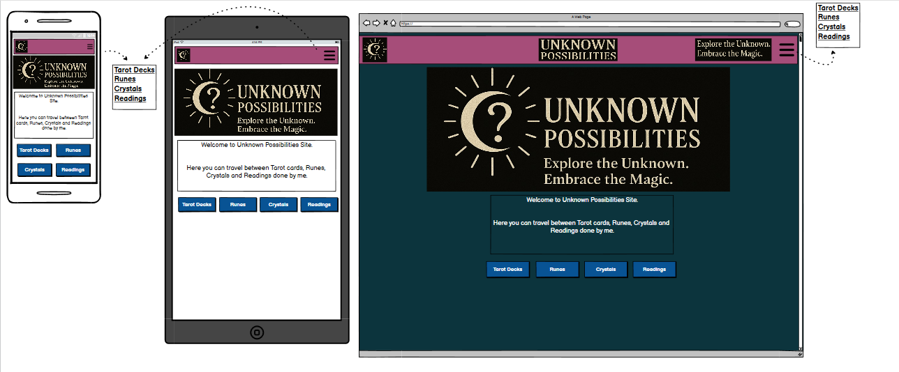


### Surface Plane

#### **Colour Scheme**


*Element Color Code Description*
Primary Background #0b0c10 Deep midnight black with a slight blue tone

Secondary Background #1f1f29 Dark gray/purple tone for cards and sections

Primary Accent (purple) #6f42c1 Mysterious purple for buttons and links

Secondary Accent (burgundy) #8b0000 Deep burgundy for some call-to-actions

Highlight #00bcd4 Shimmering turquoise for hover effects

Text (light) #f8f9fa Almost white text on dark background

Text (secondary) #ced4da Light gray for secondary text

Border/fine lines #343a40 Subtle dark gray line

Special Effect (silver/metal) #c0c0c0 Used sparingly for icons and highlights


#### **Typography**

All fonts were sourced from [Google Fonts](https://fonts.google.com/).
For the Body I used Oswald as the main font


#### **Imagery**

All the images on the site are my own.
Due to the name of the site, I have chosen to go with images that are mystical 

## Features

####  General Features
* Favicon - I used Favicon.io to create the favicon for the site. As the images I tried to use to create the favicon came out very pixelated,
 I have used the initials of the site to create the favicon using the same font and colours from the site.
 

* Navbar - The navbar on the site is split into two sections, the first section contains the search bar, an account icon and the bag icon. The second section contains the sites products categories. The navbar is fully responsive, and utilises a hamburger menu toggle on smaller screens.
The Categories links in the navbar have a transition that light up the category name up when hovered over to give the user feedback that they are selecting that category. A dropdown menu will then show with further options (Only on Products). The account icon also contains a dropdown menu which displays different options depending on whether a user is logged in, and whether the user has a superuser account.


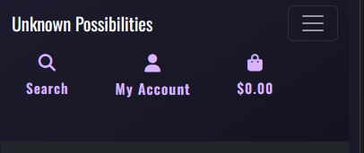

* Footer - The footer is broken into two sections - first part is a quote that changes upon reload with a new quote. The second section contains contact information for the site, such as a link to the contact form, and social media links.


* Defensive programming
Defensive programming has been used throughout the site to prevent users accessing pages when they don't have the relevant permissions. This has been accomplished by checking whether a user is a superuser for admin related tasks. If users try to access pages that they don't have the required permission level for, they will be shown an error toast which gives feedback to the user to let them know they don't have the required permissions as only an administrator can perform those tasks.

* Fully responsive and mobile-friendly layout using Bootstrap 5.

* Consistent mystical theme and styling across all pages.

* Toast messages for user feedback on actions (e.g., added to bag, login success).


---
#### Home Page
The home page of the site features a image of the logo to the site and underneath displays a text that says **Explore the Unknown** and beneath cards with each of the categories on. These cards when clicked will take a user directly to that categories product page.


---
#### Products Page
The Products page displays the products showing an image (if one is not available a default no image filler image is inserted), the products name, its price, its tags - Category and stock level.

At the top you will see the Search bar and the Sorting bar. This enables the user to sort price in ascending/descending order, and name and category in alphabetical order A-Z or Z-A.


---
#### Product Details Page
The product detail page gives more details about the chosen item. An image of the product is displayed on the left of medium and large screens, and at the top of small screens.
To the right on medium and large screens (underneath the image on small screens) is the Product information. The title is displayed followed by the price, the description for the product follows.

A quantity selector comes next, with arrow up and arrow down buttons and a quantity input which allows the user to input their value. The arrow down quantity button is disabled when the value is 1, and is enabled above this. The arrow up button is enabled until it reaches the stock level, and then becomes disabled. The user may enter more than the stock level into the quantity input box, however they will be shown a tooltip on trying to add the item to their bag letting them know the value must be equal or less than the stock level as a number.

Users are shown three buttons underneath the quantity selector, one to add the product to the bag, go back to the product page and a large button "Draw Your Daily Card, that redirect you to that page. If the user selects the add to bag button, they will be shown a success toast letting them know the product was added to the bag, and then they will be given a quick overview of the items in their bag together with their quantities, the total price excluding delivery, if they have not reached the free delivery threshold they will be given an amount they need to spend to get the free delivery and a button to go to the checkout.


The Readings-Detail comes with a booking system that allows you to book a session for a live reading with Tarot or Runes, and underneath the description its shows three fields Choose Date, Choose Duration and Choose Time. All comes with a dropdown.

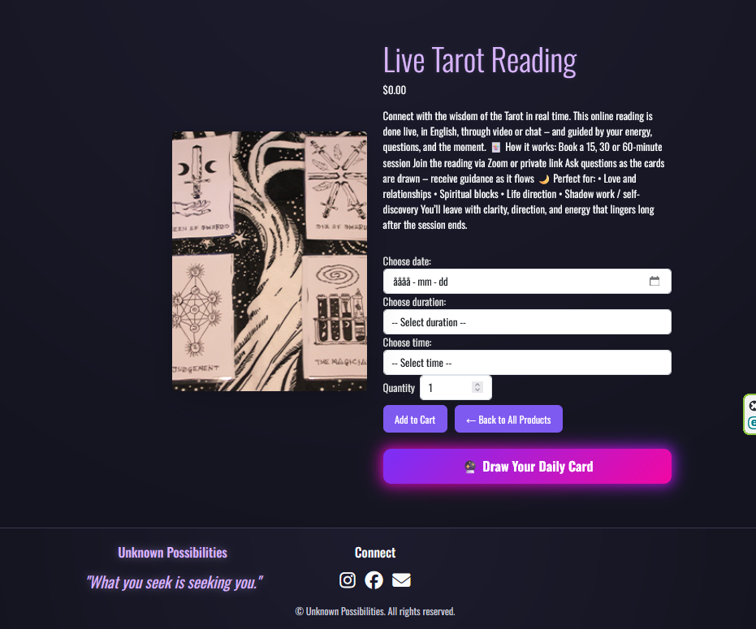

---

#### Bag Page
* The bag page lists all items the user has added to their bag. It displays an image of the item, the product name & sku, the price of the item and the quantity selected and the subtotal for that item. Users are able to adjust the quantity of the item in the bag here, as well as delete the item from their bag. Like the product detail page, the user won't be able to exceed the stock level for that item.

At the bottom the user is shown their bag total, the delivery fee and then a grand total. If the user hasn't reached the free delivery threshold, a small piece of text will highlight to the user that they only need to spend the amount shown to get free delivery. Underneath the totals are a back to shop button and a proceed to checkout button. The back to shop button takes the user back to the products page and the proceed to checkout button takes the user to the checkout.


---
#### Checkout Page

The checkout page is broken into two sections, a delivery information section and an order summary section.The delivery information section provides inputs for the user to enter their name, email and phone number, a delivery section contains inputs for the address and a dropdown to select their country. If the user is logged in and has filled out their profile, information from the profile will be pre-populated in this form, for a faster checkout experience. The user is also given a checkbox at the bottom of the delivery information which allows them to save the information they have input in their profile for future use.

If a user is not signed in during checkout, instead of the checkbox, they will be given the options to either create an account or login if they already have one. This is optional - as users can checkout as a guest, however this means that they will not be able to view their previous orders on the site.

The last section is the payment information section. Payments are processed by Stripe and to facilitate payment, a user needs to input their card details into the payment box. If the details are invalid a warning will be displayed under the payment box giving the user feedback on what the error was.

Beneath the payment section are an adjust bag button which takes the user back to their bag and a complete order button which processes their payment. Underneath the buttons the user is reminded that their card will be charged the grand total amount.

The order summary section contains an image, name, quantity and subtotal for each item in the bag, along with an order total, delivery fee and the grand total.


#### Checkout Success Page

If the payment is successful the user will then be shown the checkout success page. This lists a summary of their order and lets the user know that an email confirmation has also been sent to the email address shown on the page.

A button at the bottom of the page shows that they can return to the shop. Users are also show a success toast to let them know that their order has been placed successfully, giving them their order number and confirming an email will be sent to their email address.


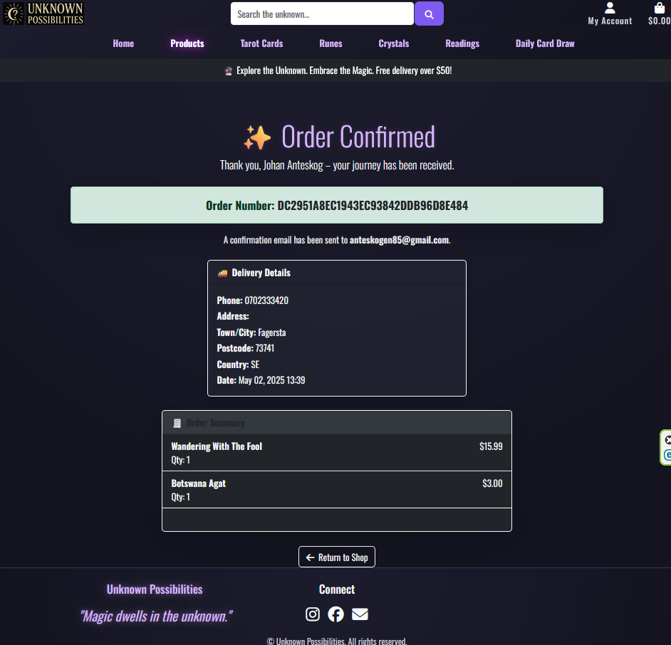

####  Profile Page 
The profile page is broken into three sections, one for the default delivery information, order history and the third section for Previous Draws.
Below the username can you see a Edit Username, there you can edit your username if you like.

The default delivery information comprises of the name, address & phone number for the user. The user can update their profile by clicking the update information button and the page will reload with the new information pre-populated in the relevant fields together with a success toast that gives the user feedback that their information has been saved successfully. This saved information will then be used in the checkout to pre-populate the payment form to speed up the checkout process for registered users.

The order history section contains all the previous orders created by the user. These list the first part of the order number, the date the order was made and the order total.

The Previous Draws section show five recent draws and information of hte cards.

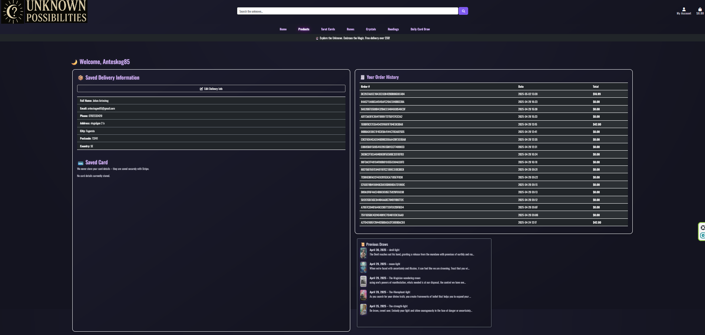

---
#### Product Management

Product Management is a list that contains all products and are in five rows Image, Name, Stock, Price and Actions.
Here you can easily update stock, edit or delete the items.
If you want to edit one item you will be redirected to a form that are filled out so you can do the changes you want.

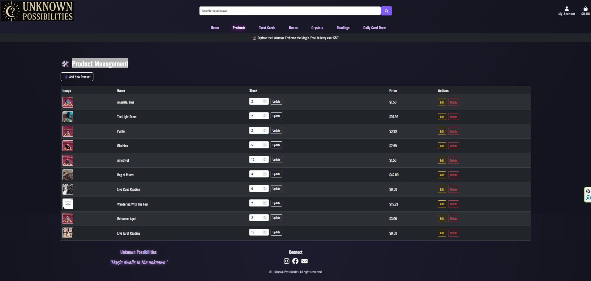

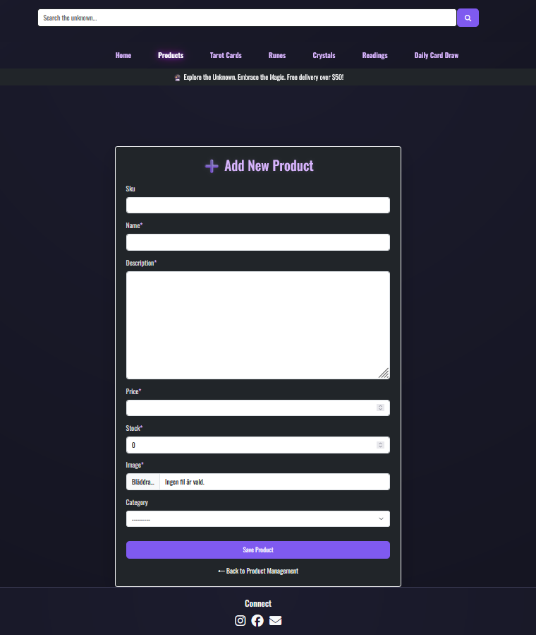
---
#### Daily Card Draw
And last but not smallest Daily Card Draw!
Here you will find Choose Your Deck choice, showing two big images and undereat them a button to press if you want just that deck.
After that you come to requested cards and are shown five hoovering cards and when pointed out one of the cards a purple shine comes from the edges of that card and when clicked the card will turn around and a bigger box will appear with information of that card.
As a superuser you will be abel to reset the cards, and as a user you can use this utility one time a day.

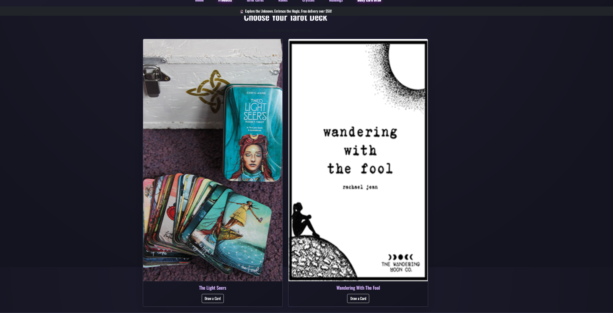

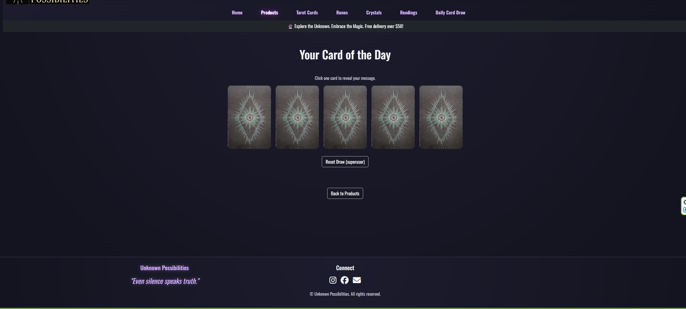

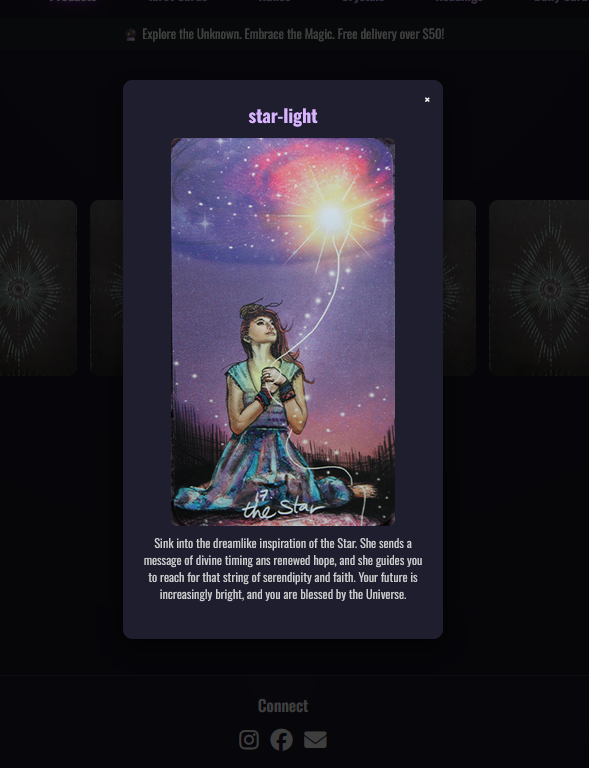

---
#### Admin Page for managing the site
The admin page for Unknown Possibilities is only accessible for superusers.
The admin page is where superusers can create, edit and delete categories, create, edit and delete products. Create, update and delete orders as well as amend/delete line items in orders.

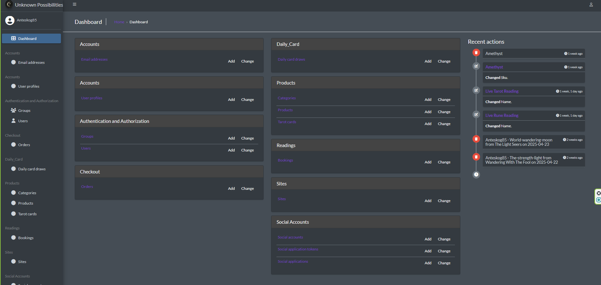

#### Delete Product Admin Only Page View

If a superuser clicks the delete link, either on the product page or from the product detail page they will be shown a pop up modal asking them to confirm the deletion and informing them that this action cannot be undone. This provides an extra layer of security to prevent items being deleted accidentally.

Regular users trying to manually access the url for product deletion will be shown an error toast informing them that only an administrator has the permissions to perform the task. Users that are not logged into an account will be redirected to the sign in page.

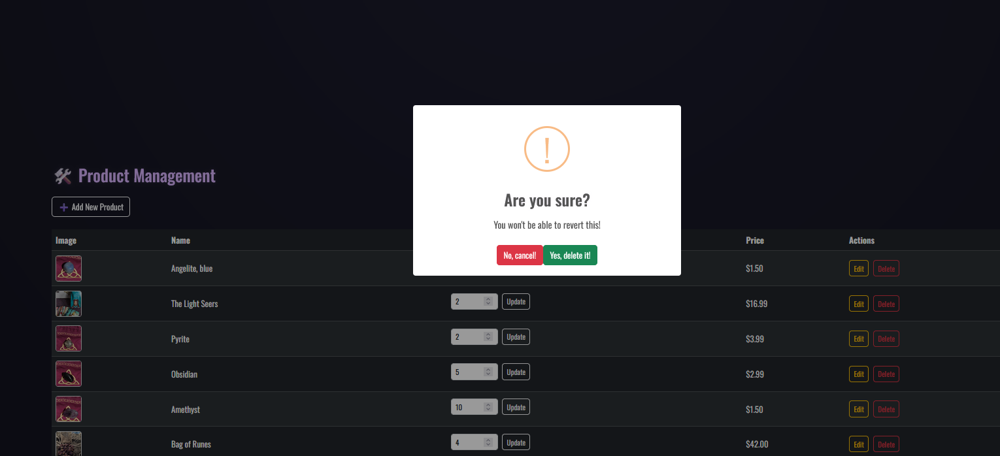

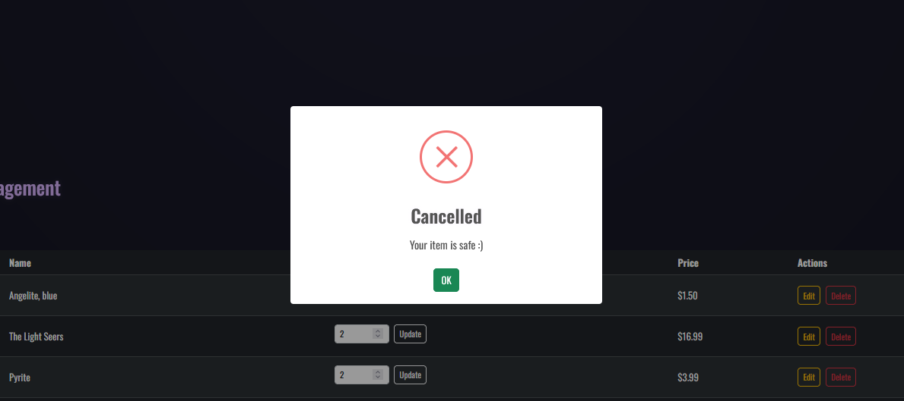


#### Signup Page 
The signup page asks the user to enter their email address twice (to prevent any input errors) select a username for their account, and then input their password twice (again to check for input errors). The user is also given two button choices - one to return to the home page and the other is to signup for an account. Once the user clicks the signup button, they will be shown

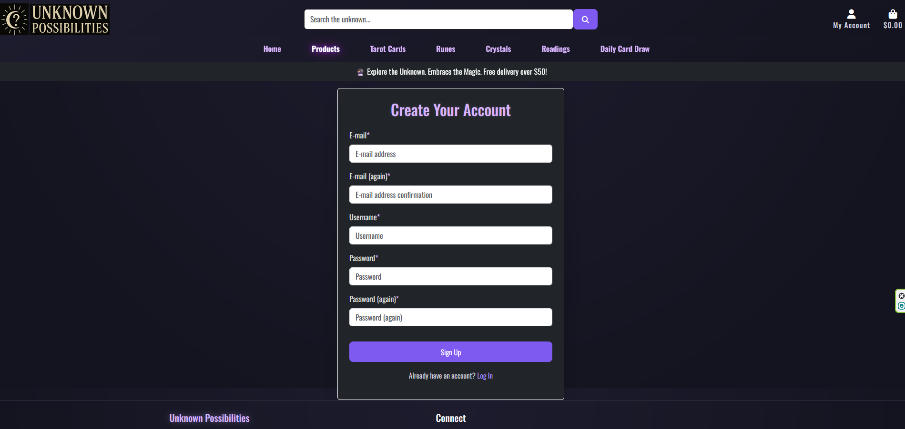

#### Log in Page
The sign in page provides inputs for a user to enter their username/email together with their password along with three buttons, a back button, a sign in button and a forgot password button. A message at the top of the page provides a link to users if they don't currently have an account which directs them to the register page. Due to time constraints I have been unable to add the social logins to this version of the site, and would look to add this in a future version.

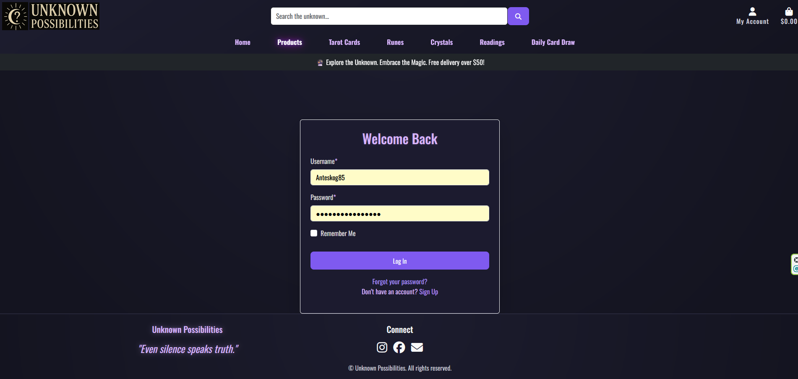

#### Log out page
When a user selects the sign out link from the account dropdown, they will be asked to confirm that they wish to sign out of their account. The user can either select the cancel button which will redirect them to the home page, or they can confirm they wish to sign out by clicking the sign out button. The user will be redirected to the home page signed out of their account and shown a success toast letting them know they were successfully signed out.

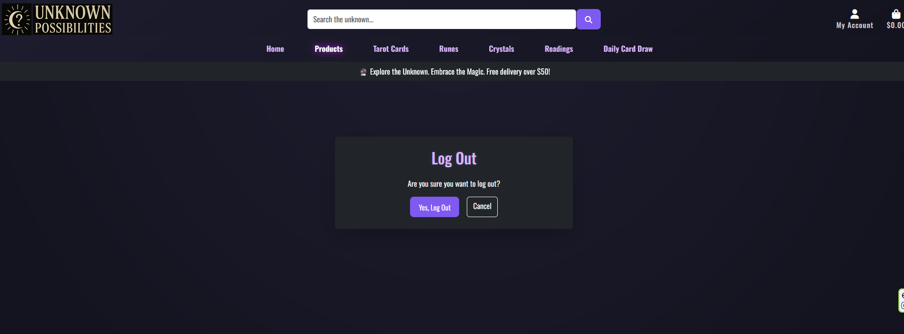

#### Forgotten Password
If a user has forgotten their password they will be asked to enter their email, and Seaside Sewing will send them an email to reset the password.


## Future Implementations

* A loyalty system with rewards for regular users.

* User-uploaded product reviews and star ratings.

* A newsletter signup for Tarot inspirations and shop updates.

* A live chat if there are questions to ask.

* AI-generated "card of the week" suggestions.

##  Technologies Used

### Languages Used:
- HTML5  
- CSS3  
- JavaScript  
- Python  

### Frameworks Used:
- [Django](https://www.djangoproject.com/)  
- [Bootstrap 5](https://getbootstrap.com/)  
- [jQuery](https://jquery.com/)  
- [Font Awesome](https://fontawesome.com/)  
- [Django-Allauth](https://django-allauth.readthedocs.io/en/latest/)  
- [Whitenoise](http://whitenoise.evans.io/en/stable/) – for static files
- [Font Awesome](https://fontawesome.com/) - Version 6.2.1 - Used for the iconography of the site, this was added using a CDN link.
- [pillow](https://pypi.org/project/Pillow/) - Python imaging library

### Libraries & Packages Used:
- [Cloudinary](https://cloudinary.com/) – media hosting  
- [Heroku](https://www.heroku.com/) – deployment  
- [GitHub](https://github.com/) – version control  
- [VS Code](https://code.visualstudio.com/) – code editor  
- [Google Fonts](https://fonts.google.com/) – custom fonts  

### Programs Used
- [Balsamiq](https://balsamiq.com/) - Used to create wireframes.
- [GitHub](https://github.com/) - To save and store the files for this project.

### Stripe

[Stripe](https://stripe.com/gb) has been used in the project to implement the payment system.

Stripe for the website is currently in developer mode, which allows us to be able to process test payments to check the function of the site.

| Type | Card No | Expiry | CVC | ZIP |
| :--- | :--- |:--- | :--- | :--- |
| Success| Visa | 4242 4242 4242 4242 | A date in the future | Any 3 digits | Any 5 digits |
| Require authorisation | 4000 0027 6000 3184 | A date in the future | Any 3 digits | Any 5 digits |
| Declined | 4000 0000 0000 0002 | A date in the future | Any 3 digits | Any 5 digits |

The checkout flow uses Stripe Elements to securely handle card information. Payment is confirmed on the frontend using `stripe.confirmCardPayment`, and the order is only created after successful payment confirmation. Failed payments (such as insufficient funds or incorrect details) are detected and reported to the user before any order is saved.
---

##  Deployment & Local Development

###  Heroku Setup
The site is hosted on Heroku. The following steps were taken:

1. Created a new Heroku app via the Heroku Dashboard.
2. Set the buildpacks:  
   - `heroku/python`  
   - `heroku/nodejs` *(for Stripe dependencies)*
3. Linked the GitHub repository to the app.
4. Set environment variables under Heroku Config Vars:
   - `SECRET_KEY`
   - `DATABASE_URL`
   - `STRIPE_PUBLIC_KEY`
   - `STRIPE_SECRET_KEY`
   - `CLOUDINARY_URL`
   - `USE_AWS = False`
5. Pushed code via GitHub and enabled automatic deploys.
6. Ran the following in the terminal:
   ```bash
   python manage.py makemigrations
   python manage.py migrate
   python manage.py createsuperuser
   python manage.py collectstatic

    ```

**Local Development**

1. Clone the repo

```bash
git clone https://github.com/Johan-4P/Unknown_Possibilities.git
```

2. Install dependencies:

```bash
pip install -r requirements.txt
```

3. Create a .env file with the necessary keys:

```env 
SECRET_KEY=your_secret_key
STRIPE_PUBLIC_KEY=your_stripe_public_key
STRIPE_SECRET_KEY=your_stripe_secret_key
CLOUDINARY_URL=your_cloudinary_url
```

4. Run the server:

```bash
python manage.py runserver
```

## Testing

Please refer to the [TESTING.md](TESTING.md) file for all testing performed.

---
### Code Used

This project was created using methods taught in the Code Institutes walkthrough project for Boutique Ado.


### Content

The Light Seer card is borrow from this maker https://lightseerstarot.com/

Content for the site was written by Johan Anteskog


### Acknowledgments

I would like to acknowledge the following people who have helped me with completing this project:
* My family for their patience and support whilst working on my final project.

* My Code Institute mentor 

* The Code Institute Tutor - Kay 

* A Big Thank You to my class mate [Sara Sundin](https://github.com/Sara-Sundin)

---

## Final Thoughts

Creating Unknown Possibilities has been an incredible journey combining creativity, logic, and intuition.  
From building a secure full-stack platform with custom features like card draws and live booking, to styling a mystical user experience, I’ve learned how powerful Django can be when merged with vision.

I’ve grown not just as a developer, but as a designer and problem-solver.

Thank you for taking the time to explore my project — I hope it inspires and surprises you.


