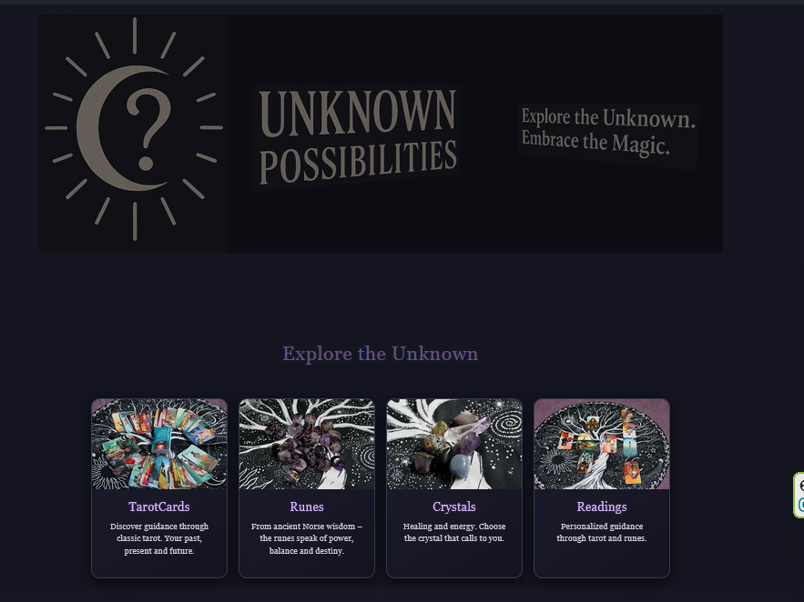
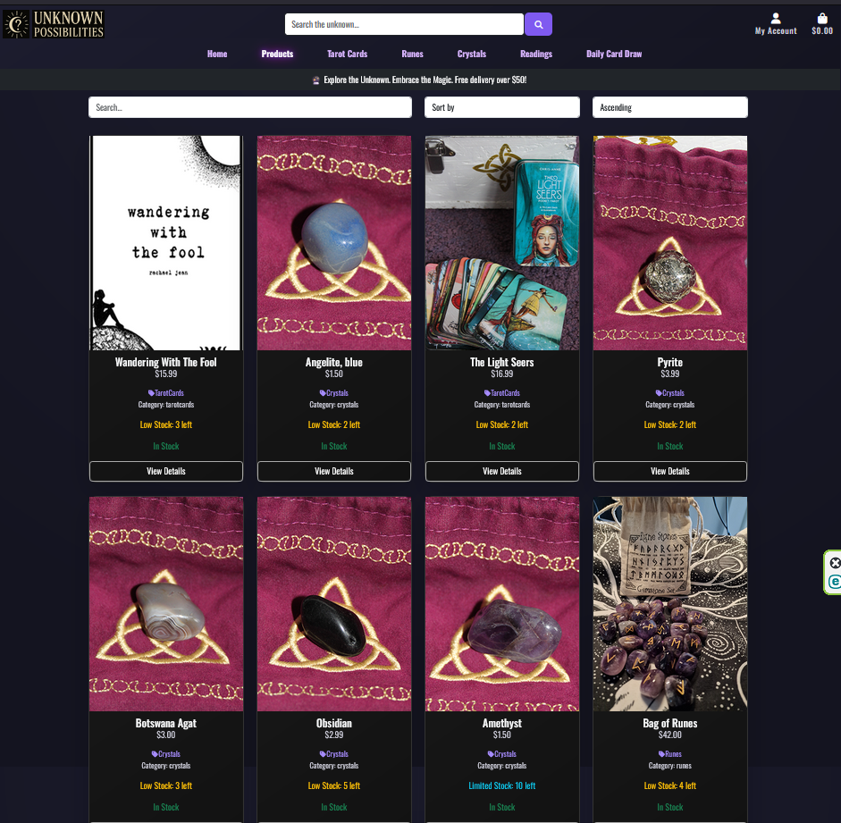
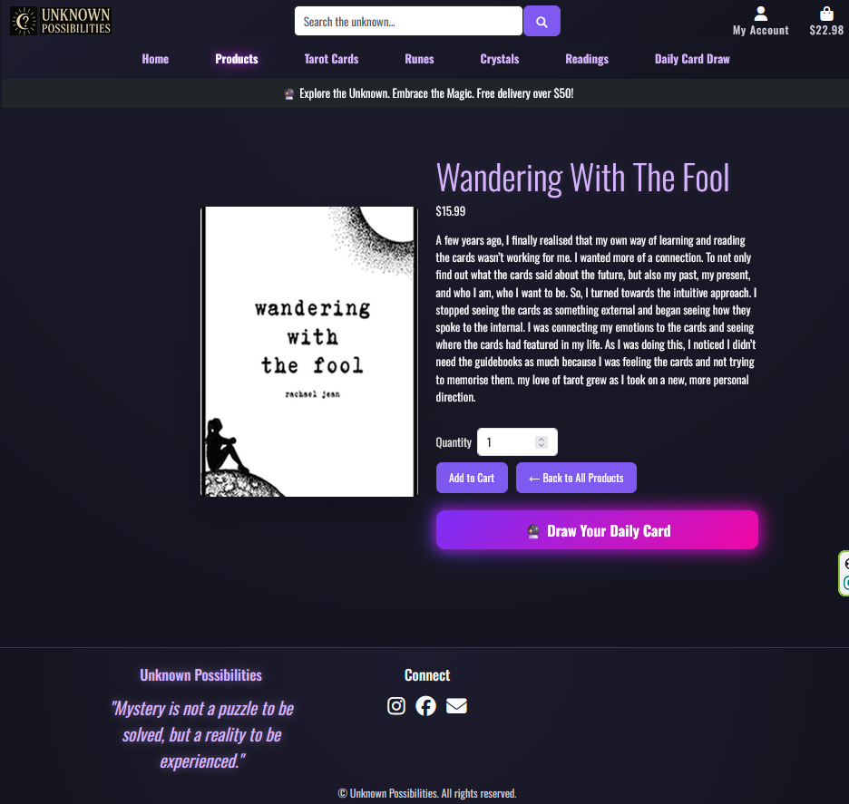
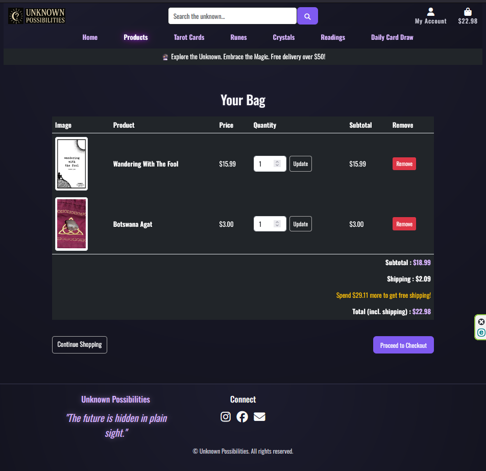
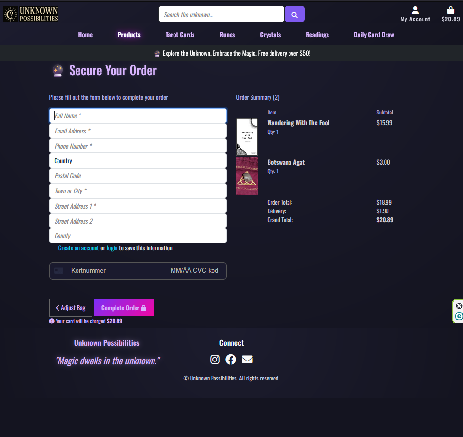

# Unknown_Possibilities


Unknown Possibilities is a full-stack e-commerce website built using Django, Python, JavaScript, and Bootstrap 5.
It was created as my fourth and final milestone project for Code Institute's Full Stack Web Development course.

The site offers mystical and spiritual products such as Tarot cards, crystal sets, Runes, and Oracle readings.
It also features an interactive "Daily Card Draw" and allows users to book readings, manage their profile, and shop securely online.

I have dyslexia and have gone through the code and content many times. I really hope the spelling is correct.


# CONTENTS

* [User Experience](#user-experience)
    * [Strategy Plane](#strategy-plane)
        * [Project Goals](#project-goals)
    * [Scope Plane](#scope-plane)
    * [Feature Planning](#feature-planning)
    * [Structure plane](#structure-plane)
        * [User Stories](#user-stories)
        * [Database Schema](#database-schema)
    * [Skeleton Plane](#skeleton-plane)
        * [Wireframes](#wireframes)
    * [Surface Plane](#surface-plane)
        * [Colour Scheme](#colour-scheme)
        * [Typography](#typography)
        * [Images](#images)
        * [Base Mockup](#base-mockup)
    *[Features](#features)
        * [General Features of the site](#general-features-of-of-the-site)
        * [Sites header and footer images](#sites-header-and-footer-images)
        * [Defensive Programming](#defensive-programming)
        * [Features for the next level](#features-for-next-version)
        * [Home Page](#home-page)
        * [Products Page](#products-page)
        * [Product Details Page](#product-detail-page)
        * [Readings With booking Page](#readings-with-booking-page)
        * [Daily Card Draw Page](#daily-card-draw-page)
        * [Bag Page](#bag-page)
        * [Admin Page for managing the site](#admin-page-for-managing-the-site)
        * [Signup Page](#signup-page)
        * [Log in page](#log-in-page)
        * [Log out page](#log-in-page)
    * [Future Implementations](#future-implementations)
    * [Accessibility](#accessibility)
    * [Technologies Used](#technologies-used)
    * [Languages Used](#languages-used)
    * [Databas Used](#database-used)
    * [Frameworks Used](#frameworks-used)
    * [Libraries & Packages Used](#libraries--packages-used)
    * [Program Used](#program-used)
    * [Deployment & Local Development](#deployment--local-development)
        * [Heroku app setup](#heroku-app-setup)
        * [Preparation for deployment in VSCode](#preparation-for-deployment-in-vscode)
    * [Testing](#testing)
    * [Credits](#credits)
        * [Code used](#code-used)
        * [Content](#content)
        * [Media](#media)
        * [Acknowledgments](#acknowledgments)

##  User Experience

###  Strategy Plane

####  Project Goals

**Site Owner Goals:**
- Create a unique online store that sells mystical items such as Tarot cards, crystals, and Rune sets.
- Offer interactive spiritual features such as a daily Tarot draw and booking options for personal readings.
- Provide a user-friendly and visually captivating shopping experience.
- Allow users to register, log in, and view their order history.
- Build a secure and responsive full-stack website using Django.

**User Goals:**
- Discover and purchase mystical products easily.
- Learn more about different spiritual tools such as Tarot and Runes.
- Book personal readings with various time slots.
- Get inspired through daily card draws.
- Manage personal profiles, view order history, and edit saved info.
- Feel immersed in a mystical, calm, and intuitive design.

---

###  Scope Plane

The site includes:
- A product catalogue for Tarot cards, crystals, runes, and readings.
- A shopping bag and Stripe-powered checkout.
- User account features with order history and saved details.
- An admin panel for managing products.
- Special features like:
  - Daily card draw (login required, once per day).
  - Bookable readings with available times and durations.

---
###  Structure Plane

####  User Stories

| User Story ID | As a/an | I want to be able to ... | So that I can... |
| :--- | :--- | :--- | :---|
| **VIEWING & NAVIGATION** |
| 1 | Shopper | View a list of the products | Select some to purchase |
| 2 | Shopper | View individual product details |  Identify the price, description, image |
| 3 | Shopper | Easily view the total of my purchases at any time |Avoid spending too much |
| **REGISTRATION & USER ACCOUNTS** |
| 4 | Shopper | Register for an account | Have an account with the site and view my profile |
| 5 | Shopper | Receive an email to confirm my registration | Verify my account was created successfully |
| 6 | Shopper | Log in and out | Keep my account information secure |
| 7 | Shopper | View a profile page | Set a default delivery address and view previous purchases |
| 8 | Shopper | Reset my password | Recover my account |
| **SORTING & SEARCHING** |
| 9 | Shopper | Sort the list of available products | Easily identify best priced and categorically sort products |
| 10 | Shopper | Sort a specific category of products | Find the best-priced in a specific category, or sort the products in that category by name |
| 11 | Shopper | Search for a product by name or description | Find a specific product I'd like to purchase |
| **PURCHASING & CHECKOUT** |
| 18 | Shopper | Easily select the quantity of a product when purchasing it | Ensure I don't accidentally select the wrong product quantity |
| 19 | Shopper | View items in my bag to be purchased | Identify the total cost of my purchase and all items I will receive |
| 20 | Shopper | Adjust the quantity of individual items in my bag | Easily make changes to my purchase before checkout |
| 21 | Shopper | Easily enter my payment information | Check out quickly and with no hassles |
| 22 | Shopper | Feel my personal and payment information is safe and secure | Confidently provide the needed information to make a purchase |
| 23 | Shopper | View an order confirmation after checkout | Verify that I haven't made any mistakes |
| 24 | Shopper | Receive an email confirmation after checking out | Keep the confirmation of what I've purchased for my records |
| **ADMIN & STORE MANAGEMENT** |
| 25 | Store Owner | Add a product | Add new items to my store |
| 26 | Store Owner | Edit/update a product | Change product prices, descriptions, images and other product criteria |
| 27 | Store Owner | Delete a product | Remove items that are no longer for sale |

---

###  Database Schema

Due to the data being used for the project I have opted to use a relational database as this will best suit my requirements.


### Skeleton Plane

#### **Wireframes**
I'm an honest person, so when I started this project, my idea was to make several wireframes and structure it very well, but when I started with Balsamiq, nothing came of it, so I started building instead and from there, there's only the first page.


### Surface Plane

#### **Colour Scheme**


*Element Color Code Description*
Primary Background #0b0c10 Deep midnight black with a slight blue tone

Secondary Background #1f1f29 Dark gray/purple tone for cards and sections

Primary Accent (purple) #6f42c1 Mysterious purple for buttons and links

Secondary Accent (burgundy) #8b0000 Deep burgundy for some call-to-actions

Highlight #00bcd4 Shimmering turquoise for hover effects

Text (light) #f8f9fa Almost white text on dark background

Text (secondary) #ced4da Light gray for secondary text

Border/fine lines #343a40 Subtle dark gray line

Special Effect (silver/metal) #c0c0c0 Used sparingly for icons and highlights


#### **Typography**

All fonts were sourced from [Google Fonts](https://fonts.google.com/).
For the Body I used Oswald as the main font


#### **Imagery**

All the images on the site are my own.
Due to the name of the site, I have chosen to go with images that are mystical 

## Features

####  General Features
* Favicon - I used Favicon.io to create the favicon for the site. As the images I tried to use to create the favicon came out very pixelated,
 I have used the initials of the site to create the favicon using the same font and colours from the site.
 

* Navbar - The navbar on the site is split into two sections, the first section contains the search bar, an account icon and the bag icon. The second section contains the sites products categories. The navbar is fully responsive, and utilises a hamburger menu toggle on smaller screens.
The Categories links in the navbar have a transition that light up the category name up when hovered over to give the user feedback that they are selecting that category. A dropdown menu will then show with further options (Only on Products). The account icon also contains a dropdown menu which displays different options depending on whether a user is logged in, and whether the user has a superuser account.


* Footer - The footer is broken into two sections - first part is a quote that changes upon reload with a new quote. The second section contains contact information for the site, such as a link to the contact form, and social media links.


* Defensive programming
Defensive programming has been used throughout the site to prevent users accessing pages when they don't have the relevant permissions. This has been accomplished by checking whether a user is a superuser for admin related tasks. If users try to access pages that they don't have the required permission level for, they will be shown an error toast which gives feedback to the user to let them know they don't have the required permissions as only an administrator can perform those tasks.

* Fully responsive and mobile-friendly layout using Bootstrap 5.

* Consistent mystical theme and styling across all pages.

* Toast messages for user feedback on actions (e.g., added to bag, login success).


---
#### Home Page
The home page of the site features a image of the logo to the site and underneath displays a text that says **Explore the Unknown** and beneath cards with each of the categories on. These cards when clicked will take a user directly to that categories product page.



---
#### Products Page
The Products page displays the products showing an image (if one is not available a default no image filler image is inserted), the products name, its price, its tags - Category and stock level.

At the top you will see the Search bar and the Sorting bar. This enables the user to sort price in ascending/descending order, and name and category in alphabetical order A-Z or Z-A.



---
#### Product Details Page
The product detail page gives more details about the chosen item. An image of the product is displayed on the left of medium and large screens, and at the top of small screens.
To the right on medium and large screens (underneath the image on small screens) is the Product information. The title is displayed followed by the price, the description for the product follows.

A quantity selector comes next, with arrow up and arrow down buttons and a quantity input which allows the user to input their value. The arrow down quantity button is disabled when the value is 1, and is enabled above this. The arrow up button is enabled until it reaches the stock level, and then becomes disabled. The user may enter more than the stock level into the quantity input box, however they will be shown a tooltip on trying to add the item to their bag letting them know the value must be equal or less than the stock level as a number.

Users are shown three buttons underneath the quantity selector, one to add the product to the bag, go back to the product page and a large button "Draw Your Daily Card, that redirect you to that page. If the user selects the add to bag button, they will be shown a success toast letting them know the product was added to the bag, and then they will be given a quick overview of the items in their bag together with their quantities, the total price excluding delivery, if they have not reached the free delivery threshold they will be given an amount they need to spend to get the free delivery and a button to go to the checkout.



The Readings-Detail comes with a booking system that allows you to book a session for a live reading with Tarot or Runes, and underneath the description its shows three fields Choose Date, Choose Duration and Choose Time. All comes with a dropdown.


---

#### Bag Page
* The bag page lists all items the user has added to their bag. It displays an image of the item, the product name & sku, the price of the item and the quantity selected and the subtotal for that item. Users are able to adjust the quantity of the item in the bag here, as well as delete the item from their bag. Like the product detail page, the user won't be able to exceed the stock level for that item.

At the bottom the user is shown their bag total, the delivery fee and then a grand total. If the user hasn't reached the free delivery threshold, a small piece of text will highlight to the user that they only need to spend the amount shown to get free delivery. Underneath the totals are a back to shop button and a proceed to checkout button. The back to shop button takes the user back to the products page and the proceed to checkout button takes the user to the checkout.


---
#### Checkout Page

The checkout page is broken into two sections, a delivery information section and an order summary section.The delivery information section provides inputs for the user to enter their name, email and phone number, a delivery section contains inputs for the address and a dropdown to select their country. If the user is logged in and has filled out their profile, information from the profile will be pre-populated in this form, for a faster checkout experience. The user is also given a checkbox at the bottom of the delivery information which allows them to save the information they have input in their profile for future use.

If a user is not signed in during checkout, instead of the checkbox, they will be given the options to either create an account or login if they already have one. This is optional - as users can checkout as a guest, however this means that they will not be able to view their previous orders on the site.

The last section is the payment information section. Payments are processed by Stripe and to facilitate payment, a user needs to input their card details into the payment box. If the details are invalid a warning will be displayed under the payment box giving the user feedback on what the error was.

Beneath the payment section are an adjust bag button which takes the user back to their bag and a complete order button which processes their payment. Underneath the buttons the user is reminded that their card will be charged the grand total amount.

The order summary section contains an image, name, quantity and subtotal for each item in the bag, along with an order total, delivery fee and the grand total.



#### Checkout Success Page

If the payment is successful the user will then be shown the checkout success page. This lists a summary of their order and lets the user know that an email confirmation has also been sent to the email address shown on the page.

A button at the bottom of the page shows that they can return to the shop. Users are also show a success toast to let them know that their order has been placed successfully, giving them their order number and confirming an email will be sent to their email address.


####  Profile Page 

---

---

##  Technologies Used

### Languages:
- HTML5  
- CSS3  
- JavaScript  
- Python  

### Frameworks & Libraries:
- [Django](https://www.djangoproject.com/)  
- [Bootstrap 5](https://getbootstrap.com/)  
- [jQuery](https://jquery.com/)  
- [Font Awesome](https://fontawesome.com/)  
- [Django-Allauth](https://django-allauth.readthedocs.io/en/latest/)  
- [Whitenoise](http://whitenoise.evans.io/en/stable/) – for static files

### Tools & Services:
- [Stripe](https://stripe.com/) – payment processing  
- [Cloudinary](https://cloudinary.com/) – media hosting  
- [Heroku](https://www.heroku.com/) – deployment  
- [GitHub](https://github.com/) – version control  
- [VS Code](https://code.visualstudio.com/) – code editor  
- [Google Fonts](https://fonts.google.com/) – custom fonts  

##  Deployment & Local Development

###  Heroku Setup
The site is hosted on Heroku. The following steps were taken:

1. Created a new Heroku app via the Heroku Dashboard.
2. Set the buildpacks:  
   - `heroku/python`  
   - `heroku/nodejs` *(for Stripe dependencies)*
3. Linked the GitHub repository to the app.
4. Set environment variables under Heroku Config Vars:
   - `SECRET_KEY`
   - `DATABASE_URL`
   - `STRIPE_PUBLIC_KEY`
   - `STRIPE_SECRET_KEY`
   - `CLOUDINARY_URL`
   - `USE_AWS = False`
5. Pushed code via GitHub and enabled automatic deploys.
6. Ran the following in the terminal:
   ```bash
   python manage.py makemigrations
   python manage.py migrate
   python manage.py createsuperuser
   python manage.py collectstatic

    ```

**Local Development**

1. Clone the repo

```bash
git clone https://github.com/your-username/unknown-possibilities.git
```

2. Install dependencies:

```bash
pip install -r requirements.txt
```

3. Create a .env file with the necessary keys:

```env 
SECRET_KEY=your_secret_key
STRIPE_PUBLIC_KEY=your_stripe_public_key
STRIPE_SECRET_KEY=your_stripe_secret_key
CLOUDINARY_URL=your_cloudinary_url
```

4. Run the server:

```bash
python manage.py runserver
```


## Future Implementations

* A loyalty system with rewards for regular users.

* User-uploaded product reviews and star ratings.

* A newsletter signup for Tarot inspirations and shop updates.

* A live chat if there are questions to ask.

* AI-generated "card of the week" suggestions.