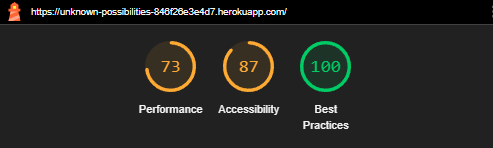
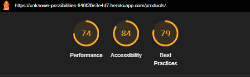
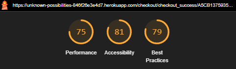

# Unknown_Possibilities

[Visit Unknown Possibilities Here](https://unknown-possibilities-846f26e3e4d7.herokuapp.com/)

---

Testing was ongoing throughout the entire build. During development I made use of Googles Developer Tools to ensure everything was working as expected and to assist me with troubleshooting when things didn't work as they should.

I have gone through each page of the site using the Chrome Developer Tools to ensure each page is responsive on a variety of different screen sizes and devices, as well as manually testing this using a variety of devices in person.

---
## Contents

* [Validation Testing](#validation-testing)
    * [HTML](#html)
    * [CSS](#css)
    * [JAVASCRIPT](#javascript)
    * [PYTHON](#python)
* [Lighthouse](#lighthouse)
    * [Desktop Results](#desktop-results)
    * [Mobile Results](#mobile-results)
* [Manual Testing](#manual-testing)
    * [Testing User Stories](#testing-user-stories)
    * [Full Testing](#full-testing)
* [Bugs](#bugs)
    * [Solved Bugs](#solved-bugs)
---

## Validation Testing

### HTML

[W3C](https://validator.w3.org/) was used to validate the HTML on all pages of the site. It was also used to validate the CSS. As the site is created with Django and utilises Django templating language within the HTML, I have checked the HTML by inspecting the page source and then running this through the validator.

| Page | Result | Evidence |
| :--- | :--- | :---: |
| Home Page | Pass | [Home Page Validation](https://validator.w3.org/nu/?doc=https%3A%2F%2Funknown-possibilities-846f26e3e4d7.herokuapp.com%2F) |
| Products Page | Pass | [Products Page Validation](https://validator.w3.org/nu/?doc=https%3A%2F%2Funknown-possibilities-846f26e3e4d7.herokuapp.com%2Fproducts%2F) |
| Products Detail Page | Pass | [Products Detail Validation](documentation/testing/validation/html/products-details-w3c.png) |
| Daily Card Page | Pass | [Daily-Card Page Validation](https://validator.w3.org/nu/?doc=https%3A%2F%2Funknown-possibilities-846f26e3e4d7.herokuapp.com%2Fdaily_card%2F) |
| Profile Page | Pass | [Profile Page Validation](https://validator.w3.org/nu/?doc=https%3A%2F%2Funknown-possibilities-846f26e3e4d7.herokuapp.com%2Faccounts%2Flogin%2F%3Fnext%3D%2Faccounts%2F) |
| Product management Page | Pass | [Product management Page validation](https://validator.w3.org/nu/?doc=https%3A%2F%2Funknown-possibilities-846f26e3e4d7.herokuapp.com%2Faccounts%2Fproduct-management%2F) |
| Bag Page | Pass | [Bag Page Validation](https://validator.w3.org/nu/?showsource=yes&doc=https%3A%2F%2Funknown-possibilities-846f26e3e4d7.herokuapp.com%2Fbag%2F) |
| Checkout Page | Pass | [Checkout Page Validation](https://validator.w3.org/nu/?showsource=yes&doc=https%3A%2F%2Funknown-possibilities-846f26e3e4d7.herokuapp.com%2Fcheckout%2F) |
| Checkout Success Page | Pass | [Checkout Success Page](https://validator.w3.org/nu/?showsource=yes&doc=https%3A%2F%2Funknown-possibilities-846f26e3e4d7.herokuapp.com%2Fcheckout%2Fcheckout_success%2F80DD2658845D4AB5BB287F3C290BD1DF%2F) |
| Edit Product Page | Pass | [Edit Product Page](https://validator.w3.org/nu/?showsource=yes&doc=https%3A%2F%2Funknown-possibilities-846f26e3e4d7.herokuapp.com%2Faccounts%2Fproduct%2F6%2Fedit%2F) |
| Add Product Page | Pass | [Add Product Page Validation](https://validator.w3.org/nu/?doc=https%3A%2F%2Funknown-possibilities-846f26e3e4d7.herokuapp.com%2Faccounts%2Flogin%2F%3Fnext%3D%2Faccounts%2Fproduct%2Fadd%2F) |
---

### CSS

[W3C](https://validator.w3.org/) was used to validate the CSS.

| File | Result | Evidence |
| :--- | :--- | :---: |
| Base.CSS | Pass | [Base.css Validation](documentation/testing/validation/css/base-css-w3c.png) |
| Checkout.CSS | Pass | [Checkout.css Validation](documentation/testing/validation/css/checkout-css.png) |
| Bag.CSS | Pass | [Bag.css Validation](documentation/testing/validation/css/bag-css.png) |
---

### JavaScript

[JS Hint](https://jshint.com/) was used to validate the JavaScript.

| File | Result | Evidence |
| :--- | :--- | :---: |
| Stripe Elements JS | Pass | [Stripe  Element JS Validation](documentation/testing/validation/js/jshint-stripe.png) |
| Card Of The Day JS | Pass | [Card Of The Day JS Validation](documentation/testing/validation/js/jshint-card-of-day.png) |
---

### Python

[Code Institute Python Linter](https://pep8ci.herokuapp.com/) was used to validate the python. I have also installed [PyCodeStyle](https://pycodestyle.pycqa.org/en/latest/intro.html#configuration) in my IDE to enable me to check my code meets PEP8 guidelines during development.

| File | Result | Evidence |
| :--- | :--- | :---: |
|**Unknown_Possibilities**|
| unknown_possibilities/settings.py | Pass | [settings.py validation](documentation/testing/validation/python/pep8-settings.png) |
| unknown_possibilities/urls.py | Pass | [urls.py validation](documentation/testing/validation/python/pep8-up-urls.png) |
| **BAG** |
| bag/contexts.py | Pass | [contexts.py validation](documentation/testing/validation/python/pep8-bag-contexts.png) |
| bag/urls.py | Pass | [urls.py validation](documentation/testing/validation/python/pep-8-bag-urls.png) |
| bag/views.py | Pass | [views.py validation](documentation/testing/validation/python/pep-8-bag-views.png) |
| bag/test.py | Pass | [test.py validation](documentation/testing/validation/python/pep-8-bag-test.png) |
| **CHECKOUT** |
| checkout/admin.py | Pass | [admin.py validation](documentation/testing/validation/python/pep-8-checkout-admin.png) |
| checkout/forms.py | Pass | [forms.py validation](documentation/testing/validation/python/pep-8-checkout-forms.png) |
| checkout/models.py | Pass | [models.py validation](documentation/testing/validation/python/pep-8-ceckout-models.png) |
| checkout/signals.py | Pass | [signals.py validation](documentation/testing/validation/python/pep-8-ceckout-signals.png) |
| checkout/urls.py | Pass | [urls.py validation](documentation/testing/validation/python/pep-8-checkout-urls.png) |
| checkout/views.py | Pass | [views.py](documentation/testing/validation/python/pep-8checkout-views.png) |
| checkout/webhooks.py | Pass| [webhooks.py](documentation/testing/validation/python/pep-8-checkout-webhooks.png) |
| checkout/test_forms.py | Pass | [test_forms.py validation](documentation/testing/validation/python/pep-8-checkout-test.png)|
| **HOME** |
| home/contexts_processors.py | Pass | [contexts_processors.py validation](documentation/testing/validation/python/pep8-h-context.png) |
| home/urls.py | Pass | [urls.py validation](documentation/testing/validation/python/pep8-h-urls.png)|
| home/views.py | Pass | [views.py validation](documentation/testing/validation/python/pep8-h-views.png) |
| home/test.py | Pass | [test.py validation](documentation/testing/validation/python/pep8-h-test.png) |
| **PRODUCTS** |
| products/admin.py | Pass | [admin.py validation](documentation/testing/validation/python/pep8-products-admin.png) |
| products/forms.py | Pass | [forms.py validation](documentation/testing/validation/python/pep8-products-forms.png) |
| products/models.py | Pass | [models.py validation](documentation/testing/validation/python/pep8-products-models.png) |
| products/urls.py | Pass | [urls.py validation](documentation/testing/validation/python/pep8-products-urls.png) |
| products/views.py | Pass | [views.py validation](documentation/testing/validation/python/pep8-products-views.png) |
| products/tests.py | Pass | [tests.py](documentation/testing/validation/python/pep8-products-test.png) |
| **ACCOUNTS** |
| accounts/apps.py | Pass | [apps.py validation](documentation/testing/validation/python/pep8-account-apps.png) |
| accounts/admin.py | Pass | [forms.py validation](documentation/testing/validation/python/pep8-account-admin.png) |
| accounts/forms.py | Pass | [forms.py validation](documentation/testing/validation/python/pep8-account-forms.png) |
| accounts/models.py | Pass | [models.py validation](documentation/testing/validation/python/pep8-account-models.png) |
| accounts/urls.py | Pass | [urls.py validation](documentation/testing/validation/python/pep8-account-urls.png) |
| accounts/views.py | Pass | [views.py validation](documentation/testing/validation/python/pep8-account-views.png) |
| accounts/tests.py | Pass | [tests.py validation](documentation/testing/validation/python/pep-8-accounts-test.png) |
| accounts/signals.py | Pass | [signals.py validation](documentation/testing/validation/python/pep8-account-signals.png) |
| **DAILY-CARDS** |
| daily-card/admin.py | Pass | [admin.py validation](documentation/testing/validation/python/pep-8-daily-admin.png) |
| daily-card/models.py | Pass | [models.py validation](documentation/testing/validation/python/pep8-dc-models.png) |
| daily-card/urls.py | Pass | [urls.py validation](documentation/testing/validation/python/pep8-dc-urls.png) |
| daily-card/views.py | Pass | [views.py validation](documentation/testing/validation/python/pep8-dc-views.png) |
| daily-card/tests.py | Pass | [tests.py validation](documentation/testing/validation/python/pep8-dc-test.png) |
| **READINGS** |
| readings/admin.py | Pass | [admin.py validation](documentation/testing/validation/python/pep8-read-admin.png) |
| readings/models.py | Pass | [models.py validation](documentation/testing/validation/python/pep8-read-models.png) |
| readings/tests.py | Pass | [tests.py validation](documentation/testing/validation/python/pep8-read-test.png) |
| readings/urls.py | Pass | [urls.py validation](documentation/testing/validation/python/pep8-read-urls.png) |
| readings/views.py | Pass | [views.py validation](documentation/testing/validation/python/pep8-read-views.png) |
| readings/forms.py | Pass | [forms.py validation](documentation/testing/validation/python/pep8-read-forms.png) |

### Lighthouse

I have used Googles Lighthouse testing to test the performance, accessibility, best practices and SEO of the site.

#### Desktop Results

| Page | Result |
| :--- | :--- |
| Home Page |  |
| Products Page |  |
| Product Details Page |  |
| Add Product Page |  |
| Edit Product Page |  |
| Bag Page |  |
| Checkout Page |  |
| Checkout Success Page |  |
| Profile Page |  |
| Daily-Card Page |  |
| Daily-Card Pick Page|   |
---

#### Mobile Results

| Page | Result |
| :--- | :--- |
| Home Page | |
| Products Page |  |
| Product Details Page |  |
| Add Product Page |  |
| Edit Product Page |  |
| Bag Page |  |
| Checkout Page |  |
| Checkout Success Page |  |
| Profile Page |  |
| Daily-Card Page |  |
| Daily-Card Pick Page|   |
---

## Automated Testing

Automated testing for this project was carried out with [Django TestCase](https://docs.djangoproject.com/en/4.1/topics/testing/overview/). I would write a test, run the test and fix any issues raised before running the test again to confirm it passed.

## Manual Testing

### Testing User Stories

| User Story ID | As a/an | I want to be able to ... | So that I can... | How is this achieved? | Evidence |
| :--- | :--- | :--- | :---| :--- | :---: |
| #5                | New user                 | register an account          | create a profile and access site features | Django Allauth registration form        | Register form tested, confirmation email received  |
| #6                | Registered user          | log in and log out           | access my personal account securely       | Login/logout via Django Allauth         | Successful login and logout tested                 |
| #7                | User who forgot password | reset my password            | regain access to my account               | "Forgot Password" form with email input | Email received and password changed successfully   |
| #8                | New user                 | confirm my email address     | verify my account and login               | Django Allauth email verification       | Confirmation email sent and verified               |
| #9                | Logged in user           | view my profile              | see my order history and personal info    | Profile page accessible when logged in  | Profile page shows correct user data               |
| #10               | User                     | sort products                | find what I want faster                   | Sorting options on product list         | Sorting tested with price and name                 |
| #11               | User                     | filter products by category  | browse products I'm interested in         | Category menu and links                 | Filtered category pages show correct products      |
| #12               | Admin                    | create multiple categories   | organize products better                  | Admin panel category creation           | Categories display correctly on site               |
| #13               | User                     | search for products          | quickly find what I'm looking for         | Search bar in navigation                | Searches return correct results                    |
| #14               | User                     | view search results          | browse items that match my keywords       | Results page with product list          | Search results page shows expected matches         |
| #15               | New visitor              | browse the site              | explore offerings before registering      | Navigation and public product pages     | Home, product and category pages browsable         |
| #16               | User                     | see a nice front page        | get a good first impression               | Custom designed home page               | Home page loads with key features                  |
| #4                | User                     | view my basket               | check my selected items before checkout   | Basket page with summary                | Items correctly listed in basket                   |
| #2                | User                     | view product details         | learn more about each product             | Product detail pages                    | Product info (image, price, description) displayed |
| #1                | User                     | view products                | browse what's available                   | Product listing page                    | Grid of products with pagination                   |

### Full Testing

Full testing was performed on the following devices:

Testing was also performed using the following browsers:

* Chrome
* FireFox

| Feature | Expected Outcome | Testing Performed | Result | Pass/Fail |
| :--- | :--- | :--- | :--- | :--- |
| **NAVBAR** |
| Account Icon | User not logged in - 2 options should be presented to a user if they are not logged in, one to register and one to login | Clicked account icon when not logged in | Dropdown menu with login and register presented | Pass |
| | User Logged in - When a user is logged in they should be shown a dropdown menu dependant on their privileges - standard users are shown the profile and logout links. Superusers are shown product management, profile and logout links. | Viewed links as a superuser and as a standard user | The correct links are displayed dependant on the users privileges | Pass |
| | Account icon links should take the user to the expected page - eg the profile link should take the user to their profile | Clicked on links | Each link takes the user to the correct page for the link | Pass |
| Bag icon | When items are added to the bag, the value underneath the bag should automatically update (this will include the delivery charge if the free delivery limit has not been reached) | Add items to cart to check the value is added | The value adds the correct amount for each product added, and includes the delivery fee if the free delivery limit has not been reached | Pass |
| | Clicking on the bag icon takes the user to their bag page which will display what they have in their bag (if any) or a message to let them know their bag is empty | Clicked on the bag icon with an empty bag and with items | Taken to the bag page, which displays items (if any in bag) or a message if no items | Pass |
| | All products - this allows the user to select how they would like to display all the products, either by rating, price, category or show all products. All links in the dropdown menu should take you to the correct page | Tested each of the links to ensure products display correctly, and that the sorting dropdown displays the choice selected | Links work as expected and the sort dropdown displays how results are being sorted | Pass |
| | Categories links when clicked display a dropdown menu of the products within that category. Each link should direct you to the correct page  | Clicked each of the links to ensure taken to the correct page | Taken to the correct page  | Pass |
| Navbar Responsiveness | Navbar should be displayed using a hamburger menu toggle on smaller screens | Checked the site on smaller screens | Navbar is displayed using a hamburger menu toggle | Pass |||||||
| **FOOTER** |
| About Section | The links in the about section should open the correct page when clicked | Clicked each link | Taken to the correct page | Pass |
| Email Icon | Clicking on Email Icon should open our email client | Clicked link | Email client opens | Pass |
|| Social Media Icons open the social page in a new browser tab | Clicked each icon | Social page opened in a new browser tab | Pass |
| Footer Responsiveness | The footer sections should become stacked on smaller screens | Looked at site on smaller screens | Sections of footer became stacked | Pass |||||||
| **HOME PAGE** |||||
| Category Cards | Clicking on a card should take the user to the products page for that category | Clicked cards and checked the right category loads | The correct categories are displayed for the right cards | Pass |||||||
| **PRODUCTS PAGE** ||||||
| Sort By dropdown | Products are sorted correctly depending on which option is chosen | Chose the different options and check to see the products are displayed by that criteria | Products are displayed according to the chosen criteria | Pass |
| Product details | Clicking on a product image will load the products detail page | Clicked on a product image | The product detail page loads for that product | Pass |
| Back to top button | Clicking on the back to top button will return the user to the top of the page to enable them to easily use the sites navigation | Clicked the back to top button while partway down the all products page | Returned to the top of the page | Pass |
| Category Tag underneath product | Clicking on the category tag will load the products page for that category | Clicked a product tag on the all products page | The products page reloads showing only the category of the tag clicked | Pass |||||||
| **PRODUCT DETAIL PAGE** |||||
| Quantity Plus Button | When you click the plus button the quantity should increase by one until you reach the stock level for the product. Once you reach the stock level, the button becomes disabled. If you lower the quantity, the plus button will reenable. | Clicked on the plus button to the stock level | Clicking on the plus button increments the quantity by 1, and once you reach the stock level the button is disabled. Lowering the quantity reenabled the plus button. | Pass |
| Quantity Minus Button | The minus button will be disabled at 1, if the quantity is more than one, the minus button will be enabled. The minus button should decrement the quantity by one | Added product, then used the minus button to lower the quantity |The button is disabled when the product quantity is 1. The quantity is decreased by 1 each time you click. | Pass |
| Add to bag button | When clicked the quantity of the item will be added to the bag. A success toast message will display letting the user know the quantity of the product added to the bag. | Incremented quantity to 4 and clicked add to bag button | A toast displays to let the user know that they have added 4 of the product to their bag and shows the image of the item with the title and quantity in the bag | Pass |
| Back button | When clicked the user will be taken back to the products page | Clicked the back button | Taken to the products page | Pass |||||||
| **DAILY CARD DRAW** |||||
| Daily Card Draw | Only allow users to draw one card per deck per day (unless superuser) | Logged in as regular user and superuser, attempted multiple draws per deck | Regular users blocked after one draw; superusers allowed unlimited draws | Pass |
| Card flip animation | Card should flip smoothly when clicked, revealing the message and image | Clicked card once as user, observed animation | Card flips as expected with animation | Pass |
| Message display | A message or interpretation appears once the card is drawn | Observed message area before and after card flip | Message appears correctly only after draw | Pass |
| Image enlargement | Card image enlarges and centers when drawn | Clicked a card and observed layout change | Card grows and centers as expected | Pass |
| Deck lock after draw | Remaining cards in that deck should be disabled after one draw | Drew one card and tried clicking others in the same deck | Other cards were disabled/unresponsive | Pass |
| User authentication required | Only logged-in users should be able to draw cards | Tried accessing as anonymous user | Prompted to log in before drawing | Pass |
| Draw reset next day | A new card can be drawn the next calendar day | Simulated next day draw (or mocked session reset) | Draw allowed after date change | Pass |
| **BAG** |||||
| Quantity Plus Button | When you click the plus button the quantity should increase by one until you reach the stock level for the product. Once you reach the stock level, the button becomes disabled. If you lower the quantity, the plus button will reenable. | Clicked on the plus button to the stock level | Clicking on the plus button increments the quantity by 1, and once you reach the stock level the button is disabled. Lowering the quantity reenabled the plus button. | Pass |
| Quantity Minus Button | The minus button will be disabled at 1, if the quantity is more than one, the minus button will be enabled. The minus button should decrement the quantity by one | Added product, then used the minus button to lower the quantity |The button is disabled when the product quantity is 1. The quantity is decreased by 1 each time you click. | Pass |
| Update Link | When a products quantity has been updated and the link clicked, a success toast displays to let the user know the update was successful along with the product and the quantity. If the user tries to update a product over the stock level they are shown an error toast. | Updated a products quantity within the stock level. Updated a products quantity over the stock level | Within the stock level, a success toast is shown with the product information and quantities. Over the stock level an error toast is displayed informing the user of the stock level and asking them to try again | Pass |
| Remove Link | When clicked the product will be removed from the basket and a success toast displayed to let the user know the action was successful, along with letting them know which product they have removed and the shopping bag page updates | Remove product from bag by clicking remove link | Clicked the remove link and a success toast is shown letting me know what product has been removed from the bag | Pass |
| Back to shop button | When clicked this will take the user to the products page | Clicked back to shop button in an empty bag and in a bag with products | Taken back to the products page each time. | Pass |
| Secure Checkout Button | When clicked the user is taken to the checkout page to fill in their details and make payment | Clicked button | Taken to checkout | Pass|
| Go to secure checkout button on success toast | A toast will be displayed each time a user adds an item to their bag which lets them know the product and quantity along with the total excluding delivery and if they haven't reached the free delivery threshold, they will be informed of how much more they need to spend to qualify. They are also shown a go to secure checkout button that allows them to navigate to the bag to confirm their items before checking out | Add product to bag, click the checkout button | The toast displays the item added to the bag, and any previous items added, together with the quantity, total excluding delivery and the spend to get free delivery message as I haven't reached the threshold. Clicking the button takes me to the bag to review my order | Pass |||||||
| **CHECKOUT PAGE** |||||
| Form Validation | The user is informed if they have not filled in required information | Submitted the form with required fields left blank | A tooltip informs the user that they need to fill in the required fields. | Pass |
| Save delivery information checkbox | When clicked, the current delivery information in the form is saved to the profile | Filled out form and checked the profile after checkout | Profile information was populated with the correct information | Pass |
| Login link on checkout page | Users are given the option to log into their account during checkout, which will allow them to save their order to their profile. If clicked the user is taken to the log in page, once logged in they can navigate to their basket to continue checkout | Not logged in as a user. Clicked the log in link, logged in | Logged in successfully and received a success toast, redirected to the home page and products are still saved in basket | Pass |
| Register Link on checkout page | Users are given the option to register for an account to be able to save their order details before checking out | Click the link, create an account | Redirected to home page and bag available | Pass |
| Payment information section | If the user has entered incorrect information in the payment section, they are given feedback about the error| Entered an invalid card number in the payment section | Information is displayed in red text below the payment information section informing the user that the number they have entered is invalid | Pass |
| Complete order button | Once the user has clicked the complete order button they should be shown a loading status overlay to let the user know their payment is processing. Once checkout has been completed they are then redirected to the checkout success page which gives a breakdown of the order | Clicked button | A loading overlay displays and then the checkout success page is displayed | Pass |||||||
| **CHECKOUT SUCCESS PAGE** |||||
| Order Confirmation Email | Upon successful checkout the user should also receive an email confirming their order at the email address provided during checkout | Made a successful purchase through the site | An email confirmation was received (this can sometimes go to junk) | Pass |||||||
| **PROFILE PAGE** |||||
| Update default delivery information | Once the user has filled in the default delivery information they wish to store and clicked the update button, the information should be saved and be available in their profile and at checkout | Add default delivery information, save and then check the information displays in their profile and at checkout | Page reloads with the updated information pre-populated and a success toast is displayed to let the user know their profile was updated successfully | Pass |
| View previous orders made from my account | Users should be able to click on the first part of their order number in the order history section and be taken to the checkout success page for that order. A toast will also inform the user that they are viewing a previous order summary for the order number | Clicked on an order number | The checkout success page is displayed with the order summary and an alert toast is displayed letting the user know this is a past confirmation for the order number | Pass |
| **SUPERUSER OPTIONS**|||||
| Account icon Product management dropdown link | This links should only be displayed to a superuser. When clicked, the superuser will be taken to the add product page. If a regular user tries to manually view this page by using the url, they are not able to view the page and an error toast displays to let them know only administrators can perform that task. | Signed in as superuser and clicked the link. Signed in as a regular user and added the url into the address bar. | Link only shown to superuser. Superusers are taken to the add product page. Regular users are shown an error toast that informs them only administrators can perform that action. | Pass |
| Add Product Form Validation | The form will only be submitted and the new product created if the required fields have been filled in | Tried to submit the form without filling in all required fields | Tooltips let me know which fields need to still be filled in | Pass |
| New product created saved in the products section of the admin page | When a product is created, a record of it should also be displayed in the products section of the admin page | Create a new product, navigate to the admin products section | We can see the record created for the new product | Pass |
| Edit Product Link | This link should only be shown when logged in as a superuser. When the edit link is clicked (either on the products page or from the product detail page) superusers are taken to the edit product page. If a regular user tries to manually access the edit page using the url, they are given an error toast letting them know only administrators can perform that action | Clicked the Edit link as a superuser.  Logged in as regular user and manually enter the url into the address bar. | The edit link is only shown when logged in as a superuser. Superusers are shown the edit product page and regular users are shown an error toast letting them know that only administrators have permission to perform that action. | Pass |
| Delete Product Link | This link should only be shown to superusers. when clicked a superuser should be shown a modal asking them to confirm they would like to delete the product, and reminds them that this action cannot be undone. If a regular user tries to manually access this page using the url, they should be shown an error toast telling them they cannot perform the action. | Clicked the link as a superuser. Manually accessed the url as a regular user. | This link is only shown to superusers. The superuser is shown a modal that asks if they are sure they want to delete the product as this action cannot be undone. Regular users are shown an error toast letting them know that only administrators can perform that action | Pass |||||||
---

## Bugs

### Solved Bugs

| No | Bug | How I solved the issue | Evidence |
|:--- | :--- | :--- | :---: |
| 1 | Users could access someone else's order by copying the checkout_success URL with an order number | Removed the order number from the URL, stored it in the session, and added a security check to ensure only the owner can view the order | Modified checkout_success view, checkout view, and urls.py |
| 2 | Double bookings were possible for "readings" products | Added a validation check that prevents booking the same date and time for the same product, and displays an error if there's a conflict | In checkout view, checked existing OrderLineItem objects before saving |
| 3 | Stock did not update after an order | Subtracted quantity from stock only if the product has a stock value (i.e., not for readings), using max(0, stock - quantity) | Handled in the product loop inside the checkout view |
| 4 | Superusers were blocked from drawing more than one "card of the day"	 | Added a condition to bypass the daily limit check for superusers	 | JavaScript and Django view were adjusted to detect request.user.is_superuser|
| 5 | Toast notifications were showing raw HTML or breaking layout	 | Modularized toast templates and avoided using mark_safe, passing data through the context cleanly instead	 | Created separate includes like toast_success.html, toast_error.html and used request.session safely|
| 6 | "Out of stock" message appeared for tarot readings which should be unlimited	 | Adjusted template and view logic to show "Out of stock" only for products that are not categorized as "readings"	 | Conditional check in product_detail.html and bag/checkout logic|
| 7 | Broken layout on profile and admin pages on smaller screens	 | Improved responsive design using Bootstrap 5 grid utilities and mobile-first layout adjustments	 | Updated HTML templates for profile and product management views|
| 8 | Checkout form wasn't prefilled for authenticated users	 | Retrieved user profile data on GET requests and prepopulated the form with address and contact info	 | Implemented in checkout view using OrderForm(initial=...)|
| 9 | Users could still access the checkout success page after session expired	 | Added a check for missing session order number and redirected unauthorized access to home	 | checkout_success view now returns error message and redirect if session is empty|
| 10 | PaymentIntent was created even when bag was empty	 | Added a check early in the checkout view to redirect and show error if no items are in the bag	 | if not bag: logic added at the top of checkout view|
---

### Known Bugs

| No | Bug | Evidence |
|:--- | :--- | :---: |